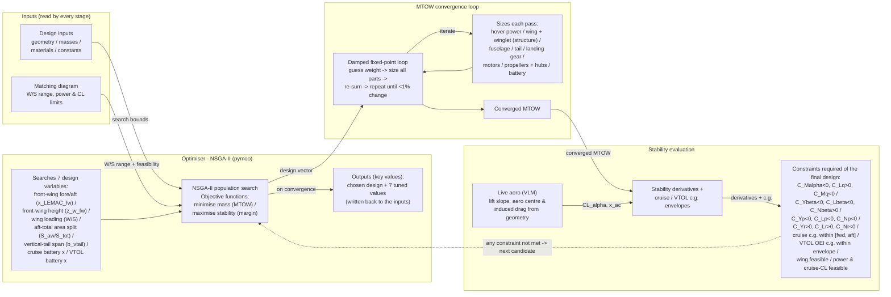
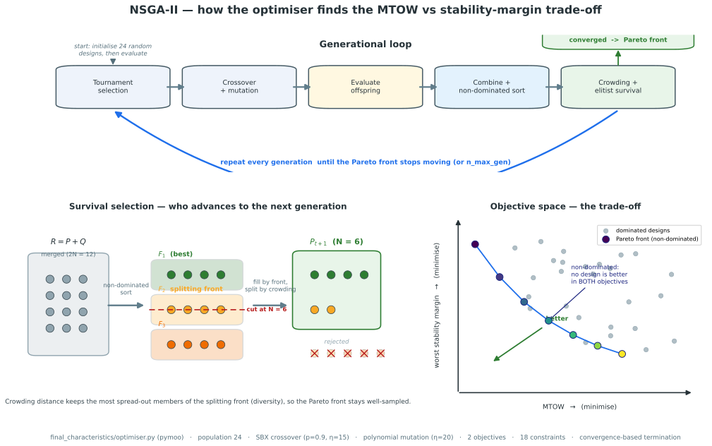

# Repository architecture

_Auto-generated by `tools/architecture_diagram.py` (static AST parse — no module is imported/executed). Re-run that script to refresh._

- Internal modules parsed: **54**  |  import edges: **82**
- Most-imported modules: parameters (29), mtow_sizing (13), mass_components (6), aircraft (5), MMOI (4)
- External libraries used: numpy, matplotlib, pathlib, sys, scipy, math, dataclasses, os, json, pymoo

## Module dependency graph

```mermaid
flowchart LR
  subgraph cl_class_II_sizing["class_II_sizing"]
    class_II_sizing_MMOI["MMOI"]
    class_II_sizing_energy["energy"]
    class_II_sizing_fuselage_sizing_plots["fuselage_sizing_plots"]
    class_II_sizing_landing_gear_sensitivity["landing_gear_sensitivity"]
    class_II_sizing_landing_gear_sketch["landing_gear_sketch"]
    class_II_sizing_loading_diagram__bubble_diagram_["loading diagram (bubble diagram)"]
    class_II_sizing_mass_components["mass_components"]
    class_II_sizing_mtow_sizing["mtow_sizing"]
    class_II_sizing_pressurization_sizing["pressurization_sizing"]
    class_II_sizing_trade_off_landing_gear["trade_off_landing_gear"]
  end
  subgraph cl_final_characteristics["final_characteristics"]
    final_characteristics_FBD_Generator_wing["FBD_Generator_wing"]
    final_characteristics_aero_calibration["aero_calibration"]
    final_characteristics_aero_model["aero_model"]
    final_characteristics_aeroacoustics["aeroacoustics"]
    final_characteristics_aux_loads["aux_loads"]
    final_characteristics_battery_cells["battery_cells"]
    final_characteristics_control["control"]
    final_characteristics_ecs_sizing["ecs_sizing"]
    final_characteristics_matching_diagram["matching_diagram"]
    final_characteristics_optimiser["optimiser"]
    final_characteristics_ppe["ppe"]
    final_characteristics_stability_eval["stability_eval"]
    final_characteristics_stability_sensitivity["stability_sensitivity"]
    final_characteristics_structures["structures"]
    final_characteristics_test_file["test file"]
  end
  subgraph cl_final_characteristics_aerodynamics["final_characteristics/aerodynamics"]
    final_characteristics_aerodynamics_airfoil_validation_airfoil_characteristics["airfoil_characteristics"]
    final_characteristics_aerodynamics_dragpolar["dragpolar"]
    final_characteristics_aerodynamics_h_b_determination_h_b_lift_ratio["h_b_lift_ratio"]
  end
  subgraph cl_final_characteristics_structures["final_characteristics/structures"]
    final_characteristics_structures_hinge_loading["hinge_loading"]
    final_characteristics_structures_hinge_loading_unit_tests["hinge_loading_unit_tests"]
    final_characteristics_structures_landing_gear_sizing["landing_gear_sizing"]
    final_characteristics_structures_legacy_code["legacy_code"]
    final_characteristics_structures_print_them_VECTORS["print them VECTORS"]
    final_characteristics_structures_test["test"]
    final_characteristics_structures_winglet_sizing["winglet_sizing"]
    final_characteristics_structures_winglet_sizing_global["winglet_sizing_global"]
  end
  subgraph cl_final_characteristics_vehicle_dynamics["final_characteristics/vehicle_dynamics"]
    final_characteristics_vehicle_dynamics_VTOL_cg_envelope_det["VTOL_cg_envelope_det"]
    final_characteristics_vehicle_dynamics_aircraft["aircraft"]
    final_characteristics_vehicle_dynamics_dyn_stab_analysis["dyn_stab_analysis"]
    final_characteristics_vehicle_dynamics_stat_long_stab_anal["stat_long_stab_anal"]
    final_characteristics_vehicle_dynamics_stat_long_stab_anal_func["stat_long_stab_anal_func"]
    final_characteristics_vehicle_dynamics_stat_long_stab_anal_vtol_oei_plot["stat_long_stab_anal_vtol_oei_plot"]
  end
  subgraph cl_final_design["final_design"]
    final_design_dump_parameters["dump_parameters"]
    final_design_figure_capture["figure_capture"]
    final_design_generate_outputs["generate_outputs"]
    final_design_run_design["run_design"]
  end
  subgraph cl_fusion["fusion"]
    fusion_fuselage_fuselage["fuselage"]
    fusion_fusion_params["fusion_params"]
    fusion_hub_hub["hub"]
    fusion_propeller_blade_propeller_blade["propeller_blade"]
  end
  subgraph cl_root["root"]
    fusion_geometry["fusion_geometry"]
    parameters["parameters"]
  end
  subgraph cl_initial_sizing["initial_sizing"]
    initial_sizing_init_wing_sizing["init_wing_sizing"]
  end
  subgraph cl_support_files["support_files"]
    support_files_oswaldefficiency["oswaldefficiency"]
  end
  class_II_sizing_MMOI --> class_II_sizing_mtow_sizing
  class_II_sizing_MMOI --> parameters
  class_II_sizing_energy --> parameters
  class_II_sizing_fuselage_sizing_plots --> class_II_sizing_mass_components
  class_II_sizing_fuselage_sizing_plots --> parameters
  class_II_sizing_landing_gear_sensitivity --> class_II_sizing_mass_components
  class_II_sizing_landing_gear_sketch --> class_II_sizing_mass_components
  class_II_sizing_landing_gear_sketch --> class_II_sizing_mtow_sizing
  class_II_sizing_landing_gear_sketch --> parameters
  class_II_sizing_loading_diagram__bubble_diagram_ --> parameters
  class_II_sizing_mass_components --> final_characteristics_structures_hinge_loading
  class_II_sizing_mass_components --> parameters
  class_II_sizing_mtow_sizing --> class_II_sizing_energy
  class_II_sizing_mtow_sizing --> class_II_sizing_mass_components
  class_II_sizing_mtow_sizing --> fusion_geometry
  class_II_sizing_mtow_sizing --> parameters
  class_II_sizing_pressurization_sizing --> class_II_sizing_mtow_sizing
  class_II_sizing_pressurization_sizing --> parameters
  class_II_sizing_trade_off_landing_gear --> class_II_sizing_mass_components
  class_II_sizing_trade_off_landing_gear --> class_II_sizing_mtow_sizing
  class_II_sizing_trade_off_landing_gear --> parameters
  final_characteristics_aero_calibration --> parameters
  final_characteristics_aero_model --> parameters
  final_characteristics_aerodynamics_dragpolar --> class_II_sizing_mtow_sizing
  final_characteristics_aerodynamics_dragpolar --> parameters
  final_characteristics_aerodynamics_h_b_determination_h_b_lift_ratio --> parameters
  final_characteristics_battery_cells --> final_characteristics_aux_loads
  final_characteristics_ecs_sizing --> parameters
  final_characteristics_matching_diagram --> class_II_sizing_mtow_sizing
  final_characteristics_matching_diagram --> parameters
  final_characteristics_matching_diagram --> support_files_oswaldefficiency
  final_characteristics_optimiser --> class_II_sizing_mtow_sizing
  final_characteristics_optimiser --> final_characteristics_matching_diagram
  final_characteristics_optimiser --> final_characteristics_stability_eval
  final_characteristics_optimiser --> parameters
  final_characteristics_ppe --> class_II_sizing_mtow_sizing
  final_characteristics_ppe --> parameters
  final_characteristics_stability_eval --> class_II_sizing_MMOI
  final_characteristics_stability_eval --> class_II_sizing_mass_components
  final_characteristics_stability_eval --> class_II_sizing_mtow_sizing
  final_characteristics_stability_eval --> final_characteristics_aero_model
  final_characteristics_stability_eval --> final_characteristics_vehicle_dynamics_VTOL_cg_envelope_det
  final_characteristics_stability_eval --> final_characteristics_vehicle_dynamics_aircraft
  final_characteristics_stability_eval --> final_characteristics_vehicle_dynamics_stat_long_stab_anal_func
  final_characteristics_stability_eval --> parameters
  final_characteristics_stability_eval --> support_files_oswaldefficiency
  final_characteristics_stability_sensitivity --> final_characteristics_stability_eval
  final_characteristics_structures --> final_characteristics_control
  final_characteristics_structures --> final_characteristics_ppe
  final_characteristics_structures_hinge_loading --> parameters
  final_characteristics_structures_hinge_loading_unit_tests --> final_characteristics_structures_hinge_loading
  final_characteristics_structures_landing_gear_sizing --> parameters
  final_characteristics_structures_winglet_sizing --> parameters
  final_characteristics_structures_winglet_sizing_global --> parameters
  final_characteristics_vehicle_dynamics_VTOL_cg_envelope_det --> class_II_sizing_mtow_sizing
  final_characteristics_vehicle_dynamics_VTOL_cg_envelope_det --> parameters
  final_characteristics_vehicle_dynamics_aircraft --> class_II_sizing_MMOI
  final_characteristics_vehicle_dynamics_aircraft --> class_II_sizing_mtow_sizing
  final_characteristics_vehicle_dynamics_aircraft --> final_characteristics_vehicle_dynamics_stat_long_stab_anal_func
  final_characteristics_vehicle_dynamics_aircraft --> parameters
  final_characteristics_vehicle_dynamics_dyn_stab_analysis --> final_characteristics_control
  final_characteristics_vehicle_dynamics_dyn_stab_analysis --> final_characteristics_vehicle_dynamics_aircraft
  final_characteristics_vehicle_dynamics_dyn_stab_analysis --> parameters
  final_characteristics_vehicle_dynamics_stat_long_stab_anal --> final_characteristics_vehicle_dynamics_aircraft
  final_characteristics_vehicle_dynamics_stat_long_stab_anal_func --> final_characteristics_vehicle_dynamics_VTOL_cg_envelope_det
  final_characteristics_vehicle_dynamics_stat_long_stab_anal_func --> final_characteristics_vehicle_dynamics_aircraft
  final_characteristics_vehicle_dynamics_stat_long_stab_anal_func --> parameters
  final_characteristics_vehicle_dynamics_stat_long_stab_anal_vtol_oei_plot --> final_characteristics_vehicle_dynamics_VTOL_cg_envelope_det
  final_characteristics_vehicle_dynamics_stat_long_stab_anal_vtol_oei_plot --> final_characteristics_vehicle_dynamics_aircraft
  final_design_dump_parameters --> parameters
  final_design_generate_outputs --> class_II_sizing_MMOI
  final_design_generate_outputs --> class_II_sizing_mtow_sizing
  final_design_generate_outputs --> final_characteristics_matching_diagram
  final_design_generate_outputs --> final_characteristics_stability_eval
  final_design_generate_outputs --> final_design_dump_parameters
  final_design_generate_outputs --> final_design_figure_capture
  final_design_generate_outputs --> parameters
  final_design_run_design --> final_characteristics_optimiser
  initial_sizing_init_wing_sizing --> parameters
  parameters --> class_II_sizing_MMOI
  parameters --> class_II_sizing_mtow_sizing
  parameters --> support_files_oswaldefficiency
```

## Runtime pipeline & data flow (curated)

Dashed red edges are `setattr` overrides the optimiser/converger patch onto module globals at runtime — coupling the import graph cannot show.

## NSGA-II optimiser — how it functions

The optimiser (`final_characteristics/optimiser.py`, pymoo) evolves a population of design vectors toward the Pareto front of (MTOW, worst stability margin). Visual explainer generated by `tools/nsga2_diagram.py`:

